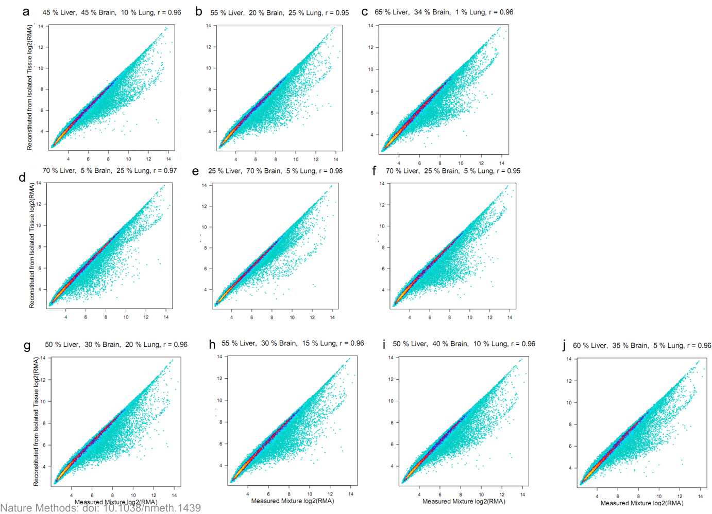
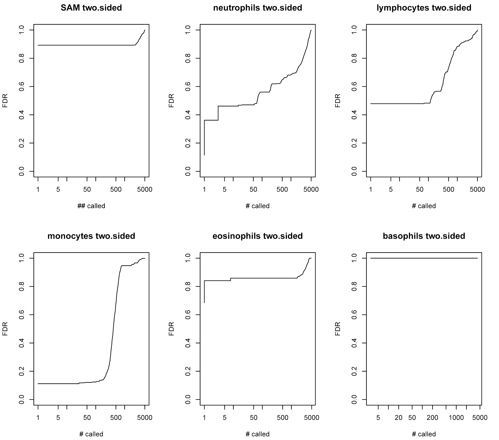

## Cell type-specific gene expression differences in complex tissues

Shen-Orr SS, Tibshirani R, Khatri P, Bodian DL, Staedtler F, Perry NM, Hastie T, Sarwal MM, Davis MM, Butte AJ.  Nature Methods 7, 287 - 289 (2010) 

## Outline

- Description of cell type-specific significance analysis of microarrays (csSAM) for analyzing differential gene expression

- Validation of csSAM with predesigned mixtures

- Application of csSAM to whole-blood gene expression datasets


## Background

- Traditional microarray analysis methods do not account for sample cell-type composition (are the changes in gene expression due to physiological changes or differences in cell-type frequency?)

- Experimental methods for isolating subsets of tissue are expensive and may affect gene expression

- A statistics based approach is to quantify the relative abundance of each cell type in each sample, then deconvolve and compare cell type-specific average expression profiles


## Overview of csSAM


## Statistical deconvolution of cell type-specific expression profiles

$$
X_{ij} = \sum\limits_{k=1}^K w_{ik}h_{kj} + e_{ij}
$$

$X$ = expression 
$i$ = sample
$j$ = gene
$w$ = cell type proportion
$k$ = cell type
$h$ = gene expression
$e$ = random error

The model is fit by a standard least-squares regression of each column of $X$ on $W$ to yield cofficients in the corresponding column of $H$

## Validation of csSAM

- Analysis of measured pure tissue and measured mixtures from the brain, liver, and lung of a single rat (Affymatrix RAE230-2 whole-genome expression arrays)
```{r, echo=FALSE}
table1 <- matrix(c(100, 0, 0, 0, 100, 0, 0, 0, 100, 5, 25, 70, 70, 5, 25, 25, 70, 5, 70, 25, 5, 45, 45, 10, 55, 20, 25, 50, 30, 20, 55, 30, 15, 50, 40, 10, 60, 35, 5, 65, 34, 1),ncol=3,byrow=TRUE)
colnames(table1) <- c("Liver","Brain","Lung")
rownames (table1) <- c("Mix 1", "Mix 2", "Mix 3", "Mix 4","Mix 5","Mix 6","Mix 7","Mix 8","Mix 9","Mix 10","Mix 11","Mix 12","Mix 13","Mix 14")
table1<-as.table(table1)
table1
```

  
## Validation of csSAM


## Validation of csSAM

- High correlation observed between measured and reconstituted mixtures (r > 0.95) suggested that statistical deconvolution of tissue-specific expression profiles from complex tissue samples using linear regression should yield accurate expression estimates for most genes

- Tested using the measured mixture samples


## Application of csSAM to whole-blood gene expression array data

- Array data from 24 pediatric renal transplant patients -- 15 experiencing acute rejection, 9 stable (whole blood, Affymatrix HGU133V2.0(+) whole-genome expression arrays)

- White blood cell subsets from Coulter counter measurements (lymphocytes, monocytes, neutrophils, eosinophils, basophils)

- Differential expression using significance analysis of microarrays (SAM) revealed no differentially expressed genes between the two groups (FDR 0.3)

##

        ==========================================================================
The high correlation between the measured and reconstituted mixtures suggests that statistical deconvolution of tissue-specific expression profiles from complex tissue samples using linear regression should yield accurate expression estimates for most genes. 

**linear regression**
>Linear regression 
A linear regression fitting model used to the measured mixture samples by measuring  mixture ratios. For each tissue, a comparison of the estimated expression profile of each subset to the measured expression pattern in the pure tissue showed a high correlation. This is indicating that they could accurately deconvolute subset specific expression patterns for the majority of genes from whole-sample measurements.

-To estimate the specificity and sensitivity of statistical deconvolution to detect differentially expressed genes, they compared deconvoluted and measured differences in gene expression between tissues. They compared the probe with abundance difference to a `gold standard' set of differentially expressed probes between tissues identified from the pure tissue sample measurements.

-Receiver operating characteristic (ROC) curve analysis showed the detection of differentially expressed genes by statistical deconvolution to be both highly specific and sensitive with an area under the curve of 0.85 and greater.


##csSAM 
Using (csSAM) to human samples in a 24 kidney transplant recipients 15 with acute rejection  and 9 stable. Distinguishing five major cells lymphocytes, monocytes, neutrophils, eosinophils and basophils.


They observed high variation in relative cell-type frequency between individuals but detected no significant differences in cell-type frequencies between the two groups (P ≥ 0.24 for all cell types). Whole-blood differential expression analysis using a previously published method, significance analysis of microarrays (SAM)11, revealed no deferentially expressed genes between the two groups at a relatively permissive false discovery rate (FDR) of 0.3 and reduction in the number of multiple hypothesis tests.

        
##        Validation with Predesigned Mixtures
        ========================================================
        Dataset
        - cRNA derived from brain, liver, and lung tissues of a single rat. 
        - Pure brain, liver and lung tissue samples as well as 10 mixture ratios of the tissues.
        - Frozen samples were hybridized to rat specific RAE230_2 whole-genome expresssion arrays (Affymetrix).
        - Normalized using robust multi-array average (RMA).
        
        
##        R package
        ========================================================
        `csSAM` package available at CRAN:
        
        Install the package
```{r, eval=FALSE}
        install.packages("csSAM")
```
        and load it.
```{r}
        library(csSAM)
```
        
        
##        Getting the Data with GEOquery
        ========================================================
        
```{r, eval=FALSE}
        ## install packages
        source("http://bioconductor.org/biocLite.R")
        biocLite("GEOquery")
```
        
```{r}
        ## load package
        library(GEOquery)
```
        
```{r, cache=TRUE}
        ## download data 
        ## NOTE: Create folder named "Data" in current directory first
# gdsRat <- getGEO("GSE19830")  ## TODO: error cannot load
        
        ## read in data
#gdsRat <- getGEO(filename = "./Data/GSE19830_series_matrix.txt") 
gdsRat <- getGEO("GSE19830", destdir = getwd())
gdsRat <- gdsRat[[1]]

```
        
        
##        Data Cleaning
        ========================================================
        
```{r, cache=TRUE}
        ## function to obtain % liver, brain, lung info in each sample
        sanitize_rat_pdata <- function(pd) {
          keepCols <- c("source_name_ch1", "source_name_ch1", "source_name_ch1")  
          pd <- pd[, keepCols]
          colnames(pd) <- c("liver", "brain", "lung")
          pd$liver <- sapply(as.character(pd$liver), FUN=function(x) {unlist(strsplit(x, split=" / "))[1]})
          pd$liver <- as.numeric(gsub(" % Liver", "", pd$liver))
          pd$brain <- sapply(as.character(pd$brain), FUN=function(x) {unlist(strsplit(x, split=" / "))[2]})
          pd$brain <- as.numeric(gsub(" % Brain", "", pd$brain))
          pd$lung <- sapply(as.character(pd$lung), FUN=function(x) {unlist(strsplit(x, split=" / "))[3]})
          pd$lung <- as.numeric(gsub(" % Lung", "", pd$lung))
          return(pd)
        }
        
        ## retrieve probe information matrix of rat dataset and clean 
        ratProbeMat <- sanitize_rat_pdata(pData(gdsRat))
```
        
        
##        Extracting Gene Expression Data We Need
        ========================================================
```{r, cache=TRUE}
        ## retrieve gene expression matrix of rat dataset
        ratExprMat <- exprs(gdsRat)
        
        ## get gene expression data of pure liver, brain and lung tissues
        liverRows <- which(ratProbeMat$liver == 100 & ratProbeMat$brain == 0 & ratProbeMat$lung == 0)
        liverExprMat <- ratExprMat[, rownames(ratProbeMat)[liverRows]]
        brainRows <- which(ratProbeMat$liver == 0 & ratProbeMat$brain == 100 & ratProbeMat$lung == 0)
        brainExprMat <- ratExprMat[, rownames(ratProbeMat)[brainRows]]
        lungRows <- which(ratProbeMat$liver == 0 & ratProbeMat$brain == 0 & ratProbeMat$lung == 100)
        lungExprMat <- ratExprMat[, rownames(ratProbeMat)[lungRows]]
        
        ## get average values over technical replicates of pure tissues
        pureLiverExpr <- apply(liverExprMat, MARGIN=1, mean)
        pureBrainExpr <- apply(brainExprMat, MARGIN=1, mean)
        pureLungExpr <- apply(lungExprMat, MARGIN=1, mean)
```
        
        
##        Extracting Gene Expression Data We Need
        ========================================================
```{r, cache=TRUE}
        ## get gene expression data of tissue mixture samples
        excludeRows <- which(ratProbeMat$liver == 5 & ratProbeMat$brain == 25 & ratProbeMat$lung == 70)  ## not used for analysis due to high frequency of lung tissue
        mixtureRows <- rownames(ratProbeMat)[-c(liverRows, brainRows, lungRows, excludeRows)]
        mixtureExpr <- ratExprMat[, mixtureRows]
```
        
        
##        Cell Type Proportion Matrix
        ========================================================
```{r, cache=TRUE}
        ## get matrix of cell type proportion
        ratCellFreq <- as.matrix(ratProbeMat[mixtureRows, ]) / 100
```
        
        
##        Statistical Deconvolution of Mixture Tissues
        ========================================================
```{r}
        ## deconvolution
        deconvFit <- csfit(ratCellFreq, t(mixtureExpr))
        
        ## estimates of cell type specific gene expression from deconvolution
        deconvExpr <- deconvFit$ghat
        rownames(deconvExpr) <- c("liver", "brain", "lung")
        deconvLiverExpr <- deconvExpr[c("liver"), ]
        deconvBrainExpr <- deconvExpr[c("brain"), ]
        deconvLungExpr <- deconvExpr[c("lung"), ]
```
        
        
##        Density Plot of Deconvolved VS Pure Tissue (Liver)
        ========================================================
```{r, echo=FALSE, eval=FALSE}
        install.packages("ggplot2")
```
        
```{r, echo=FALSE}
        library(ggplot2)
```
        
```{r}
#install.packages("hexbin")
 # library(hexbin)

        qplot(pureLiverExpr, deconvLiverExpr, geom = "hex", binwidth = c(0.1, 0.1), xlab="pure tissue", ylab="deconvolved", main="liver") 
```
        correlation = `r cor(pureLiverExpr, deconvLiverExpr)`
        
        
##        Density Plot of Deconvolved VS Pure Tissue (Brain)
        ========================================================
```{r}
        qplot(pureBrainExpr, deconvBrainExpr, geom = "hex", binwidth = c(0.1, 0.1), xlab="pure tissue", ylab="deconvolved", main="brain")  
```
        correlation = `r cor(pureBrainExpr, deconvBrainExpr)`
        
        
##        Density Plot of Deconvolved VS Pure Tissue (Lung)
        ========================================================
```{r}
        qplot(pureBrainExpr, deconvBrainExpr, geom = "hex", binwidth = c(0.1, 0.1), xlab="pure tissue", ylab="deconvolved", main="lung")  
```
        correlation = `r cor(pureLungExpr, deconvLungExpr)`


## SAM

- SAM (Significance Analysis of Microarrays)

Regularized t-test: 
$$ 
t_g=\frac{\left(\bar{y}_{1g}-\bar{y}_{2g}\right)} {\sqrt{s^2_{1g}/R_1+s^2_{2g}/R_2+c}}
$$
c is positive constant to regularize variance estimate.

-csSAM: combine statistical deconvolution with SAM

## Getting data with GEOquery
        
```{r, cache=TRUE}
gdsKidney <- getGEO("GSE20300", destdir = getwd())
gdsKidney <- gdsKidney[[1]]
        sanitize_kidney_pdata <- function(pd) {
          keepCols <- c("characteristics_ch1", "title") 
          pd <- pd[, keepCols]
          colnames(pd) <- c("state", "number") 
          pd$state <- tolower(gsub("transplant state: ", "", pd$state))
          pd$state[which(pd$state == "acute rejection")] <- gsub(" rejection", "", pd$state[which(pd$state == "acute rejection")])
          pd$number <- gsub(" (.+)", "", pd$number)
          pd$number <- as.numeric(gsub(".+-P", "", pd$number))
          return(pd)
        }

        kidneyProbeMat <- sanitize_kidney_pdata(pData(gdsKidney))
        sampleOrder <- with(kidneyProbeMat, order(state, number))
        kidneyProbeMat <- kidneyProbeMat[sampleOrder, ]
```
        
        
## Extracting gene expression

```{r, cache=TRUE}
        ## matrix of kidney data, ordered by sample
        kidneyExprMat <- exprs(gdsKidney)
        kidneyExprMat <- kidneyExprMat[, sampleOrder]
```
        
        
## Subsetting 5000 most variables genes

```{r, cache=TRUE}
        ## 5000 most variable genes across samples
        geneExprVar <- apply(kidneyExprMat, 1, var)
        geneExprOrderedByVar <- kidneyExprMat[order(geneExprVar, decreasing=TRUE), ]
        top5000Expr <- geneExprOrderedByVar[1:5000, ]
```
        
        
## Matrix of cell frequency

```{r, cache=TRUE, echo=FALSE}
        ## Matrix of cell type proportion found in supplementary data
        kidneyCellFreq <- rbind(c(38, 47.5, 12.4, 1.4, 0.8),
                                c(70.7, 17.1, 11.8, 0.1, 0.3),
                                c(62.1, 20.3, 14.6, 2.5, 0.5),
                                c(90.5, 2, 4.8, 2.4, 0.3),
                                c(65.8, 25, 7.3, 1.4, 0.5),
                                c(39.2, 37.1, 14.1, 9.2, 0.4),
                                c(89.4, 6.3, 3.7, 0.1, 0.5),
                                c(91.3, 1.6, 4.6, 2.5, 0),
                                c(55.4, 31.3, 8.4, 4.6, 0.3),
                                c(14.5, 61.5, 21.9, 1.3, 0.8),
                                c(81, 17.9, 0.4, 0.6, 0.1),
                                c(53.8, 37.2, 8.4, 0.4, 0.2),
                                c(59.9, 32.6, 5.8, 1.5, 0.3),
                                c(77, 18.5, 4.1, 0.2, 0.2),
                                c(47.8, 39.7, 6.6, 4.7, 1.2),
                                c(76.4, 19.4, 3.6, 0.4, 0.2),
                                c(58.5, 28, 9.6, 3.3, 0.6),
                                c(60.5, 27.8, 8.3, 2.8, 0.6),
                                c(43.6, 44, 5.8, 6.5, 0),
                                c(63.4, 23.1, 11.6, 1.6, 0.3),
                                c(50.1, 30.6, 18.1, 1.2, 0),
                                c(54.8, 15.2, 27.8, 1.6, 0.6),
                                c(47.7, 37.8, 12.1, 1.6, 0.8),
                                c(30.4, 52, 9.4, 7.7, 0.5))
        colnames(kidneyCellFreq) <- c("neutrophils", "lymphocytes", "monocytes", "eosinophils", "basophils")
        write.table(kidneyCellFreq, "./kidneyCellFreq.txt", row.names=FALSE)
```
        
```{r, cache=TRUE}
        ## read in matrix of cell type proportion and change values from % into proportion
        kidneyCellFreq <- read.table("./kidneyCellFreq.txt", header=TRUE)
        kidneyCellFreq <- kidneyCellFreq / 100 / 100
```
        
        
## csSAM

        Need vector of group association for each sample
```{r, cache=TRUE}
        ## group label (stable=1, acute=2)
        patientGroups <- ifelse(kidneyProbeMat$state == "stable", 1, 2)
        

        ## csSAM
        wrapper.output <- csSamWrapper(t(top5000Expr), kidneyCellFreq, patientGroups)
```

## False discovery rate plots




## Conclusions 

- csSAM localizes identified differential expression to a particular cellular context

- The methodology can be used with microarray analysis of any heterogeneous tissue and can be applied to other types of molecular measurements

- Limitations include potential inaccuracies due to probe saturation and cross-hybridization, genes whose cellular expression changes in response to the changes in the cell subset composition of their microenvironment


 

